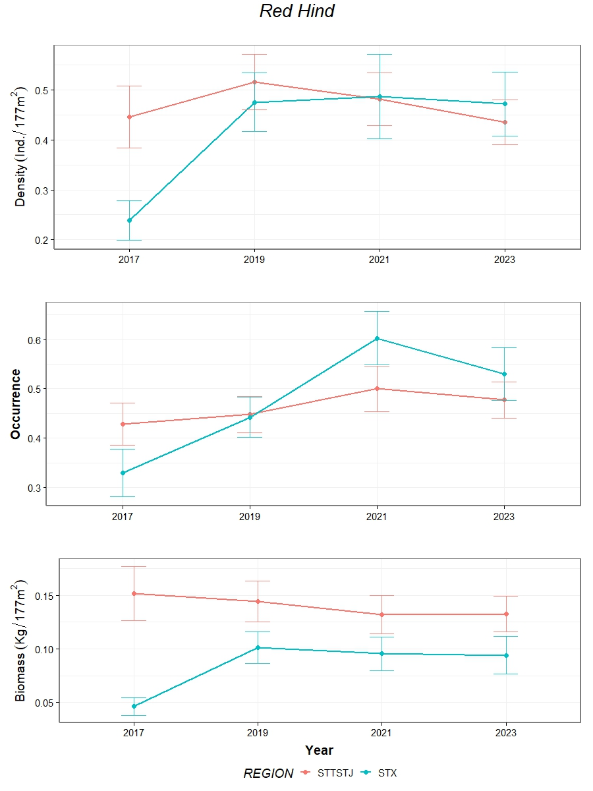

```{r setup, include=FALSE}
knitr::opts_chunk$set(echo = TRUE)
```

This week you will use a R-package that analyzes NCRMP Fish data. This package estimates common metrics we use for population-level analysis.

## Install Fish R-package

[rvc](https://github.com/jeremiaheb/rvc)

```{r, eval=FALSE}
install.packages('devtools')

devtools::install_github('jeremiaheb/rvc')
```

## Examine the Fish R-package

The Fish R-package (rvc) has a lot of functions available for estimating common metrics including density, occurrence, biomass, length frequency...and much more.

You will first need to get the data using the function

``` {.r eval="FALSE"}
getRvcData(years = , regions = )
```

years = list or sequence of years

regions = vector of regions you

-   You will use "STTSTJ" and "STX"

For example: The following code will get all the data from 2017, 2019, 2021 and 2023 in both the St. Thomas/John and St. Croix regions and set it to the value 'USVI'

```{r eval=FALSE}
USVI <- getRvcData(years = 2017:2023, regions =  c("STTSTJ", "STX"))
```

Now explore a few of the basic functions to see what the function outputs.

```{r eval=FALSE}
getDomainBiomass(x = USVI, species = "EPI GUTT")
getDomainDensity(x = USVI, species = "BAL VETU")
getDomainOccurrence(x = USVI, species = "SPA VIRI")
```

## Exercise

I would like for you to create a function(s) that creates the following set of plots.

hints:

1)  Use grid() and gridExtra() or patchwork() packages arrange the 3 plots on one page
2)  All plots will need error bars (standard error).

-   $SE = \sqrt{var}$

3)  Use the 'rvc' package functions and some 'tidyverse' functions for all your needs.

**Your final function should only take in a dataset and a species name to produce the plot.**

```{css echo=FALSE}
.bordered{
  border-style: solid;
}
```

::: bordered

:::
