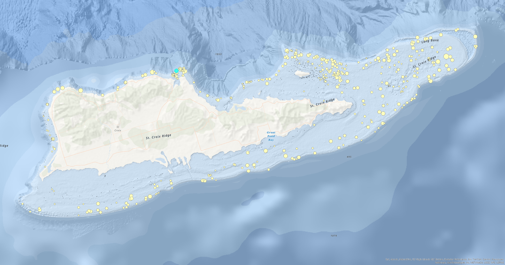

```{r setup, include=FALSE}
knitr::opts_chunk$set(echo = TRUE)
```

## Working with Model Builder

This week you will create a fairly simple data processing model in Model Builder.

The idea of this model is to take in a large datatset (table) of St Croix fish density at every site over three years and be able to produce a point shapefile for a **single species**. This point shapefile will need to have some additional information from other shapefiles. It will then be easy to plot and visualize the distribution and density of a single species.

------------------------------------------------------------------------

GIS data <br>

-   [ ] STX_Fish_PSU (table)
-   [ ] STX_Habitat_Map (shapefile)
-   [ ] STX_SampleFrame (shapefile)

------------------------------------------------------------------------

Your model should work as follows...

Starting with the large tabular dataset (STX_Fish_PSU), your model should output a single point shapefile showing sample site density of a single fish species. Your output should include depth and habitat type (these will come from other feature classes) and then a new field (depth_ft) that you will need to calculate.

Again, this will be a multi-step process. Inspect all the data first and come up with a workflow using all the tools you have learned to develop a model. Once completed, you will be able to reuse this model with any species you desire.

```{css echo=FALSE}
.bordered{
  border-style: solid;
}
```

::: bordered

:::
